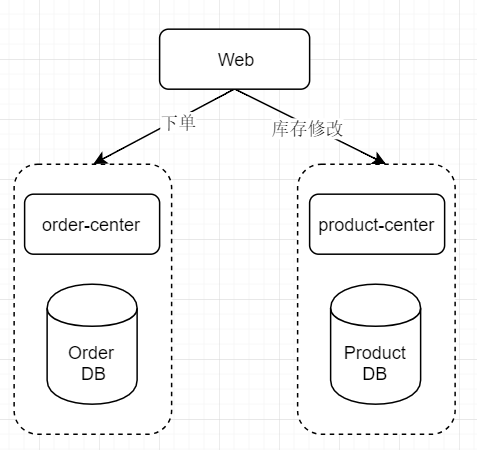

# dubbo-example

dubbo 实战案例Demo，使用zookeeper作为注册中心，mysql作为存储中间件，包含分布式事务。

项目服务模块结构如下：



web模块调用order-center订单中心服务与product-center产品中心服务，完成商品购买业务。其中，下单与库存修改处于同一事务下。

## 环境配置

环境包含zookeeper与mysql，位于docker文件夹下，以此执行以下命令，搭建运行环境：

```shell
cd docker
docker-compose up
```

开发的端口为 3306(mysql) 与 2181(zookeeper)