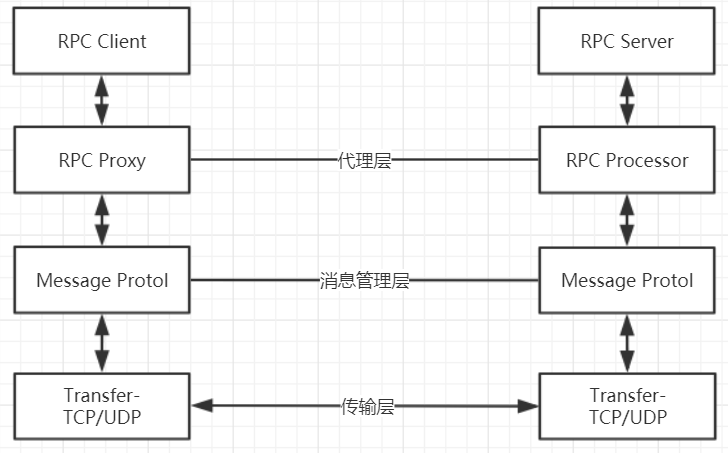

# RMI

## 什么是 RPC

Remote Procedure Call Protocol 远程过程调用协议

客户端在不知道细节的情况下，调用远程服务器上的某个类的某个方法，就像调用自己的方法一样，这样的过程成为 RPC 

RPC 协议是一个规范，常见的规范有：
- RMI
- Webservice
- Dubbo
- Thrif
- Hessain

网络协议和网络IO对于调用端和服务端是透明的（不需要关心协议和IO就可以使用），一个优秀的RPC具有跨语言的能力

RPC框架的要素：

1. 传输层使用TCP/UDP进行通信，即Socket
2. 消息管理层，包含数据处理、序列化/反序列化方式
3. 代理层，用于屏蔽客户端与服务端的调用细节

## 什么是 RMI

Remote Method Invocation 远程方法调用，是RPC的Java版本。

RMI使用 JRMP(Java Remote Message Protocol)协议，是专门为Java设计的一套传输方案，只可以使用在Java语言中。

## 使用RMI
1. 创建远程接口， 并且继承java.rmi.Remote接口
2. 实现远程接口，并且继承UnicastRemoteObject
3. 创建服务器程序： createRegistry方法注册远程对象
4. 创建客户端程序，调用rmi接口

## 实现RMI
1. 编写服务器程序，暴露一个监听， 可以使用socket
2. 编写客户端程序，通过ip和端口连接到指定的服务器，并且将数据做封装（序列化）
3. 服务器端收到请求，先反序列化。再进行业务逻辑处理。把返回结果序列化返回

