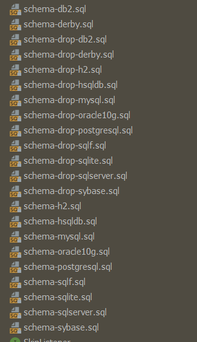
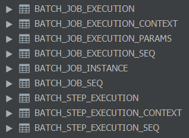

# Spring Batch

## 什么是批处理

1. 有限的数据
2. 无交互
3. 执行中无中断

> 比如，Hadoop与Spark等离线计算就是一种批处理

## 应用场景

- ETL(Extract Transform Load) 数据抽取转换与加载
- Report，报表
- Big Data，Hadoop、Spark
- Data Science，比如预算模型
- 非交互式应用

## 什么是Spring Batch

Spring Batch是一款Spring提供的轻量级、完善的批处理框架，旨在帮助企业建立健壮高效的批处理应用。

Spring Batch基于JSR-352(Java批处理规范)，并提供了大量可重用组件，包含日志、追踪、事务、任务作业统计、任务重启、跳过、重复、资源管理。对于大数据量和高性能的批处理任务，Spring Batch同样提供了高级功能特性来支持，比如分区、远程。

Spring Batch是一个批处理框架，并不是一个调度框架，他只关心批处理任务的相关问题，比如事务、并发、监控、执行等。使用需要结合调度框架进行使用，比如Quartz， Tivoli、Control-M、Cron等。

Spring Batch 主要又以下几个功能：

- Transaction Management 事务管理
- Chunk Based Processing 基于块的处理
- Declarative I/O 声明式输入输出
- Error Handling 错误处理
- Scalability Ability 可扩展机制 （分布式处理、与第三方集成，比如Hadoop）
- Start/Stop/Restart 启动/停止/重启
- Retry/Skip 重试/跳过

> Spring Batch 基于 Spring Framework

## Spring Batch Hello World

创建一个Spring Boot项目，并添加如下依赖：

```xml
<dependency>
    <groupId>org.springframework.boot</groupId>
    <artifactId>spring-boot-starter-test</artifactId>
    <scope>test</scope>
</dependency>
<dependency>
    <groupId>org.springframework.boot</groupId>
    <artifactId>spring-boot-starter-batch</artifactId>
</dependency>
<dependency>
    <groupId>org.springframework.batch</groupId>
    <artifactId>spring-batch-test</artifactId>
    <scope>test</scope>
</dependency>
<!-- Spring Batch 需要依赖一个可持久化的数据源才可以运行，这里使用h2 无需任何配置 -->
<dependency>
    <groupId>com.h2database</groupId>
    <artifactId>h2</artifactId>
    <scope>runtime</scope>
</dependency>
```

在config包下，新建SpringBatch配置类：

```java
@Configuration
@EnableBatchProcessing // 启用批处理
public class JobConfiguration {

    // 用于构建job，一个job可能包含多个step，一个step就是一个job任务的一个步骤
    @Resource
    private JobBuilderFactory jobBuilderFactory;

    // 用于构建step，代表一个job步骤
    @Resource
    private StepBuilderFactory stepBuilderFactory;

    @Bean
    public Job helloWorldJob() {
        return jobBuilderFactory
                .get("helloWorldJob")
                .start(step1())
                .build();
    }

    @Bean
    public Step step1() {
        // 一个job包含一个tasklet，代表具体执行的逻辑内容
        return stepBuilderFactory.get("step1").tasklet(new Tasklet() {
            @Override
            public RepeatStatus execute(StepContribution stepContribution, ChunkContext chunkContext) throws Exception {
                System.out.println("hello spring batch!!!");
                // 步骤执行完毕需要返回一个状态，告诉job执行情况，这里是执行结束
                return RepeatStatus.FINISHED;
            }
        }).build();
    }
}
```

启动main方法，运行Spring Batch项目：

```
  .   ____          _            __ _ _
 /\\ / ___'_ __ _ _(_)_ __  __ _ \ \ \ \
( ( )\___ | '_ | '_| | '_ \/ _` | \ \ \ \
 \\/  ___)| |_)| | | | | || (_| |  ) ) ) )
  '  |____| .__|_| |_|_| |_\__, | / / / /
 =========|_|==============|___/=/_/_/_/
 :: Spring Boot ::        (v2.1.6.RELEASE)

2019-07-13 14:51:46.446  INFO 29416 --- [           main] c.y.d.taskbatch.TaskScheduleApplication  : Starting TaskScheduleApplication on Feathers with PID 29416 (D:\OneDrive\Github\spring-notes\spring-boot-2x\task-batch\target\classes started by Feathers in D:\OneDrive\Github\spring-notes\spring-boot-2x\task-batch)
2019-07-13 14:51:46.448  INFO 29416 --- [           main] c.y.d.taskbatch.TaskScheduleApplication  : No active profile set, falling back to default profiles: default
2019-07-13 14:51:47.018  INFO 29416 --- [           main] com.zaxxer.hikari.HikariDataSource       : HikariPool-1 - Starting...
2019-07-13 14:51:47.074  INFO 29416 --- [           main] com.zaxxer.hikari.HikariDataSource       : HikariPool-1 - Start completed.
######### 没有找到数据源配置，使用内存数据库h2
2019-07-13 14:51:47.080  INFO 29416 --- [           main] 
o.s.b.c.r.s.JobRepositoryFactoryBean     : No database type set, using meta data indicating: H2
#########
2019-07-13 14:51:47.134  INFO 29416 --- [           main] o.s.b.c.l.support.SimpleJobLauncher      : No TaskExecutor has been set, defaulting to synchronous executor.
2019-07-13 14:51:47.237  INFO 29416 --- [           main] c.y.d.taskbatch.TaskScheduleApplication  : Started TaskScheduleApplication in 1.032 seconds (JVM running for 1.838)
2019-07-13 14:51:47.238  INFO 29416 --- [           main] o.s.b.a.b.JobLauncherCommandLineRunner   : Running default command line with: []
######## 定义的helloWorldJob开始执行
2019-07-13 14:51:47.272  INFO 29416 --- [           main] o.s.b.c.l.support.SimpleJobLauncher      : Job: [SimpleJob: [name=helloWorldJob]] launched with the following parameters: [{}]
### 执行他的第一个步骤
2019-07-13 14:51:47.283  INFO 29416 --- [           main] o.s.batch.core.job.SimpleStepHandler     : Executing step: [step1]
########## 任务执行了
hello spring batch!!!
##########
2019-07-13 14:51:47.297  INFO 29416 --- [           main] o.s.b.c.l.support.SimpleJobLauncher      : Job: [SimpleJob: [name=helloWorldJob]] completed with the following parameters: [{}] and the following status: [COMPLETED]
2019-07-13 14:51:47.301  INFO 29416 --- [       Thread-1] com.zaxxer.hikari.HikariDataSource       : HikariPool-1 - Shutdown initiated...
2019-07-13 14:51:47.304  INFO 29416 --- [       Thread-1] com.zaxxer.hikari.HikariDataSource       : HikariPool-1 - Shutdown completed.
```

## 使用Mysql替代H2

在线上环境上，一般不会使用内存数据库进行批处理，这里我们尝试使用Mysql来替代H2，修改POM文件，将H2的依赖注释掉，并添加Mysql依赖：

```xml
<dependency>
    <groupId>mysql</groupId>
    <artifactId>mysql-connector-java</artifactId>
</dependency>
<dependency>
    <groupId>org.springframework.boot</groupId>
    <artifactId>spring-boot-starter-jdbc</artifactId>
</dependency>
```

添加配置：

```yaml
spring:
  datasource:
    url: jdbc:mysql://192.168.52.111:3306/springbatch
    username: root
    password: 123456
    schema: classpath:/org/springframework/batch/core/schema-mysql.sql
  batch:
    initialize-schema: always
```

其中schema属性是指需要初始化的Spring Batch相关的表结构,位于`spring-batch-core-4.1.2.RELEASE.jar`的`org.springframework.batch.core`包下，包含很多不同数据库的sql schema文件：



启动SpringBoot项目：

```
  .   ____          _            __ _ _
 /\\ / ___'_ __ _ _(_)_ __  __ _ \ \ \ \
( ( )\___ | '_ | '_| | '_ \/ _` | \ \ \ \
 \\/  ___)| |_)| | | | | || (_| |  ) ) ) )
  '  |____| .__|_| |_|_| |_\__, | / / / /
 =========|_|==============|___/=/_/_/_/
 :: Spring Boot ::        (v2.1.6.RELEASE)

2019-07-13 15:11:01.832  INFO 6340 --- [           main] c.y.d.taskbatch.TaskScheduleApplication  : Starting TaskScheduleApplication on Feathers with PID 6340 (D:\OneDrive\Github\spring-notes\spring-boot-2x\task-batch\target\classes started by Feathers in D:\OneDrive\Github\spring-notes\spring-boot-2x\task-batch)
2019-07-13 15:11:01.837  INFO 6340 --- [           main] c.y.d.taskbatch.TaskScheduleApplication  : No active profile set, falling back to default profiles: default
2019-07-13 15:11:02.445  INFO 6340 --- [           main] com.zaxxer.hikari.HikariDataSource       : HikariPool-1 - Starting...
2019-07-13 15:11:02.775  INFO 6340 --- [           main] com.zaxxer.hikari.HikariDataSource       : HikariPool-1 - Start completed.
### 使用了Mysql作为数据源
2019-07-13 15:11:02.860  INFO 6340 --- [           main] o.s.b.c.r.s.JobRepositoryFactoryBean     : No database type set, using meta data indicating: MYSQL
2019-07-13 15:11:02.935  INFO 6340 --- [           main] o.s.b.c.l.support.SimpleJobLauncher      : No TaskExecutor has been set, defaulting to synchronous executor.
2019-07-13 15:11:03.707  INFO 6340 --- [           main] c.y.d.taskbatch.TaskScheduleApplication  : Started TaskScheduleApplication in 2.139 seconds (JVM running for 2.918)
2019-07-13 15:11:03.708  INFO 6340 --- [           main] o.s.b.a.b.JobLauncherCommandLineRunner   : Running default command line with: []
2019-07-13 15:11:03.786  INFO 6340 --- [           main] o.s.b.c.l.support.SimpleJobLauncher      : Job: [SimpleJob: [name=helloWorldJob]] launched with the following parameters: [{}]
2019-07-13 15:11:03.819  INFO 6340 --- [           main] o.s.batch.core.job.SimpleStepHandler     : Executing step: [step1]
hello spring batch!!!
2019-07-13 15:11:03.902  INFO 6340 --- [           main] o.s.b.c.l.support.SimpleJobLauncher      : Job: [SimpleJob: [name=helloWorldJob]] completed with the following parameters: [{}] and the following status: [COMPLETED]
2019-07-13 15:11:03.909  INFO 6340 --- [       Thread-1] com.zaxxer.hikari.HikariDataSource       : HikariPool-1 - Shutdown initiated...
2019-07-13 15:11:03.919  INFO 6340 --- [       Thread-1] com.zaxxer.hikari.HikariDataSource       : HikariPool-1 - Shutdown completed.
```

连接Mysql，会发现Spring Batch帮助我们生成了如下几张表：



## Spring Batch的相关概念

Spring Batch以` Job` 为执行单位，一个`Job`代表一个批处理任务执行流程。`Job`可接受`JobParamters`作为参数，生成`JobInstance`实例，此类代表一个具体的`Job`任务。

`JobLauncher`.而一个`Job`又是由一个或者多个`Step`组成，即一个批处理任务由多个步骤顺序执行完成。11

## 创建并使用Job

