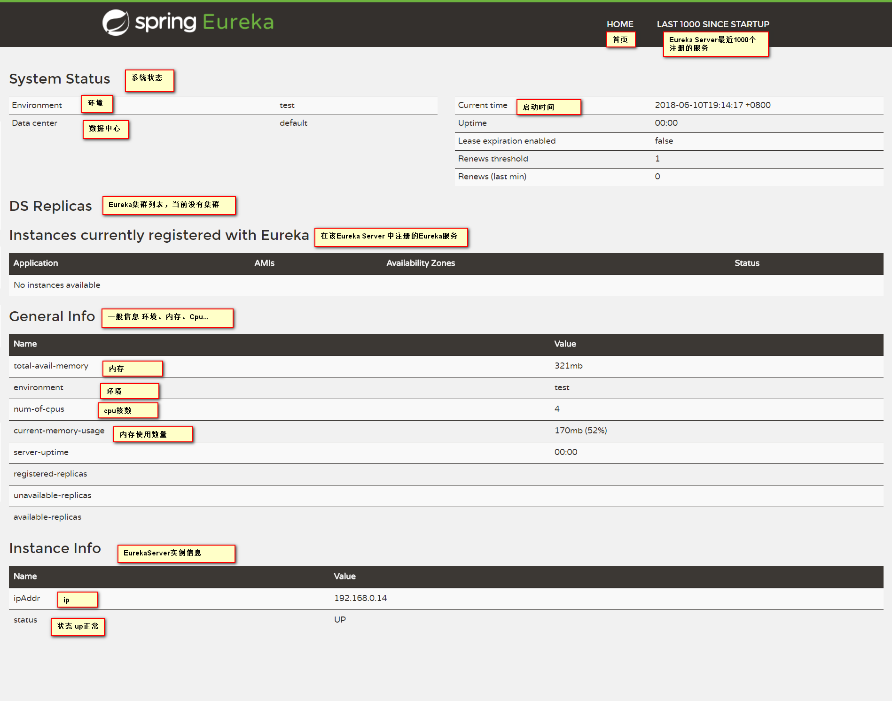
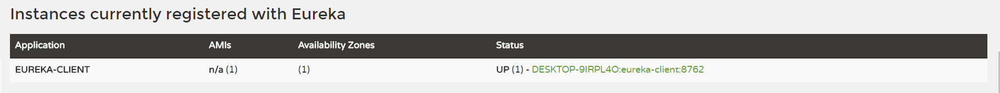

# 服务注册中心

需要组件Spring Cloud Netflix的Eureka ,eureka是一个服务注册和发现模块

加入Eureka服务发现组件以来：
```xml
<dependency>
    <groupId>org.springframework.cloud</groupId>
    <artifactId>spring-cloud-starter-netflix-eureka-server</artifactId>
</dependency>
```

配置配置文件：
1. 配置Eureka服务端实例端口
    ```yaml
    server:
      port: 8761
    ```
2. 配置Eureka实例
    ```yaml
    eureka:
      instance:
        # 配置Eureka服务的主机名
        hostname: localhost
      client:
        # 是否注册到Eureka服务中心，false，该实例就是一个Eureka服务中心
        registerWithEureka: false
        # 是否合并别的Eureka上的数据，false，不合并
        fetchRegistry: false
        # Eureka服务地址，/eureka不可丢失
        serviceUrl:
          defaultZone: http://${eureka.instance.hostname}:${server.port}/eureka/
    ```
3. 声明该Application是一个Eureka服务发现组件：
    ```java
    @EnableEurekaServer // 激活EurekaServer服务，即声明该类启动后是一个Eureka注册中心
    @SpringBootApplication
    public class EurekaServerApplication {
    }
    ```

启动项目，即可启动Eureka服务。

访问项目根路径，如`localhost:8761`，可以查看和管理Eureka服务的状态：



# 创建Eureka Client

添加maven依赖：
```xml
<dependency>
    <groupId>org.springframework.cloud</groupId>
    <artifactId>spring-cloud-starter-netflix-eureka-client</artifactId>
</dependency>
```

声明该项目是一个Eureka Client：
```java
@EnableEurekaClient
//@EnableDiscoveryClient
@SpringBootApplication
public class EurekaClientApplication {
}
```

也可以使用注解EnableDiscoveryClient，区别在于，如果你是用其他的注册中心，比如ZooKeeper，可以使用@EnableDiscoveryClient注解支持。
而EnableEurekaClient是Eureka的专属配置。

配置文件配置：
```yaml
server:
  port: 8762
#配置注册中心地址
eureka:
  client:
    serviceUrl:
      defaultZone: http://localhost:8761/eureka/
  #eurekaClient实例配置
  instance:
    prefer-ip-address: true  #true将ip注册到EurekaServer中，将机器名注册到EurekaServer上
spring:
  application:
    name: eureka-client
```

启动eureka-client项目，再次访问eureka-server主页，可以看到


可以看到注册的名称是机器名。

**EMERGENCY! EUREKA MAY BE INCORRECTLY CLAIMING INSTANCES ARE UP WHEN THEY'RE NOT. RENEWALS ARE LESSER THAN THRESHOLD AND HENCE THE INSTANCES ARE NOT BEING EXPIRED JUST TO BE SAFE.**的错误提示：
代表Eureka进入了 self-preservation 自我保护状态。
保护模式主要用于一组客户端和Eureka Server之间存在网络分区场景下的保护。一旦进入保护模式，Eureka Server将会尝试保护其服务注册表中的信息，不再删除服务注册表中的数据（也就是不会注销任何微服务）
比如，eureka-server中注册了eureka-client的节点，现在将eureka-client程序停止，eureka-server不会将eureka-client踢除。

> https://github.com/Netflix/eureka/wiki/Understanding-Eureka-Peer-to-Peer-Communication 
> keywords: self-preservation


